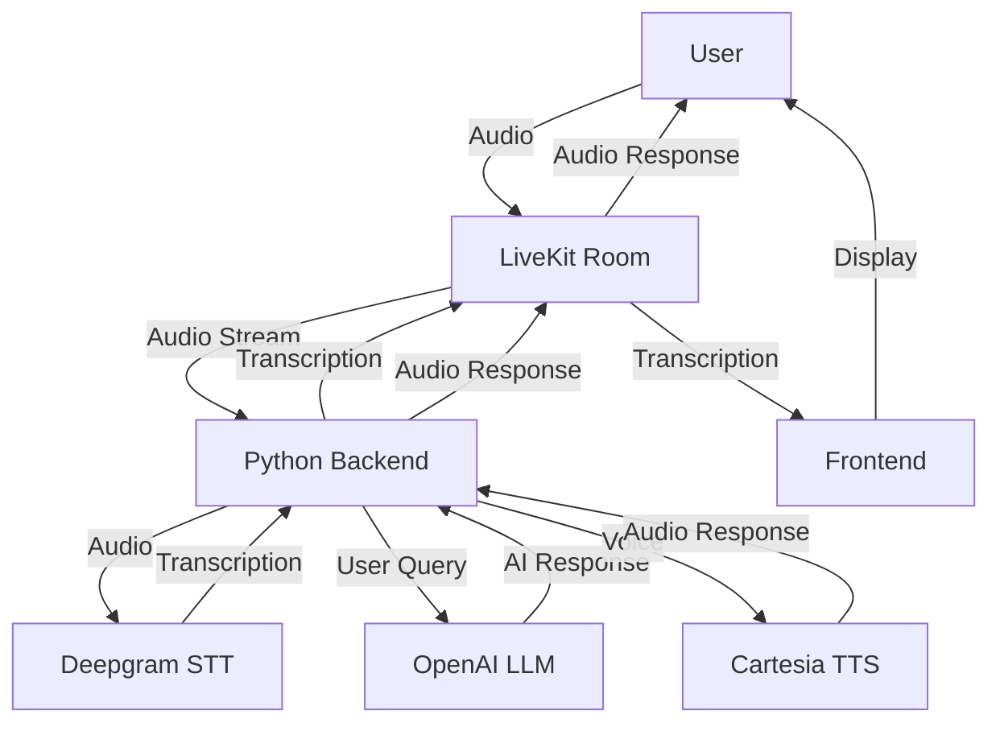

# Neura Project

Neura is a modern application that integrates AI-powered speech recognition and natural language processing capabilities using LiveKit and Deepgram.

## Project Overview

The project consists of:

- **Frontend**: A Next.js web application with LiveKit components for real-time communication
- **Backend**: A Python backend using LiveKit Agents and Deepgram for speech-to-text

## Features

- 🎙️ Real-time speech-to-text using Deepgram's nova-3 model
- 🤖 AI assistant with natural language understanding
- 🌐 Real-time audio/video communication
- 🔄 Dynamic configuration options
- 🧠 Conversational AI capabilities

## Architecture



## Getting Started

### Prerequisites

- Node.js 16+ for the frontend
- Python 3.8+ for the backend
- API keys for:
  - LiveKit
  - OpenAI
  - Deepgram
  - Cartesia

### Setup

1. Clone the repository:

```bash
git clone https://github.com/yourusername/neura.git
cd neura
```

2. Run the setup script to install all dependencies:

```bash
npm run setup
```

3. Configure the environment variables:
   - Copy `.env.example` to `.env` in both `neura-frontend-web` and `neura-backend-py` directories
   - Fill in your API keys and configuration

### Running the Application

You can run both the frontend and backend with a single command:

```bash
npm run dev
```

Or run them separately:

```bash
# Run just the frontend
npm run frontend

# Run just the backend
npm run backend
```

## Project Structure

```
neura/
├── neura-frontend-web/     # Next.js frontend application
├── neura-backend-py/       # Python backend for LiveKit and Deepgram
│   ├── agent/              # AI assistant implementation
│   ├── services/           # Backend services (transcription, etc.)
│   └── utils/              # Utility functions
├── package.json            # Root package.json with workspace configuration
└── README.md               # This file
```

## Development

The project is set up with npm workspaces, making it easy to manage both the frontend and backend together:

- **Frontend**: Located in `neura-frontend-web/`
- **Backend**: Located in `neura-backend-py/`

### Making Changes

- Frontend: Edit files in `neura-frontend-web/src/`
- Backend: Edit files in `neura-backend-py/`

## License

[MIT License](LICENSE)
