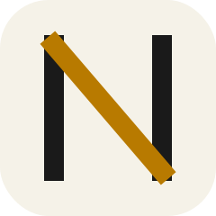
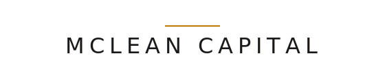

<table border="0">
<tr>
<td width="160" align="center" valign="middle">
<picture>
<source media="(prefers-color-scheme: dark)" srcset="assets/logos/final/neura-app-icon.svg">

</picture>
</td>
<td valign="middle">
<h1>Neura</h1>
<p><strong>A voice-first AI operating system.</strong> Say the wake word and talk — no click-to-start, no tap-to-speak. Neura listens ambiently on-device, activates when called, and proactively handles your tasks, memories, and deadlines.</p>
</td>
</tr>
</table>

<p align="center">
  <a href="https://www.npmjs.com/package/@mclean-capital/neura"></a>
  <a href="https://www.npmjs.com/package/@mclean-capital/neura"></a>
  <a href="https://github.com/mclean-capital/neura/actions/workflows/release.yml"></a>
  <a href="./LICENSE"></a>
  <a href="https://nodejs.org"></a>
</p>

## How It Works

Neura uses a hybrid multi-model architecture: **Grok** handles voice conversation (Eve voice) while **Gemini** runs as a continuous vision watcher that builds temporal visual context. The two are bridged via tool calls — when you ask "what do you see?", the voice model queries the watcher, which has been watching your camera or screen the entire time.

```
Camera/Screen (every 2s) → Gemini Live (watcher, 3-6 min visual memory)
Mic audio → Grok (Eve voice)
                └─ tool call → text query to watcher → Grok speaks result
```

## Install

### Prerequisites

- [Node.js](https://nodejs.org/) **>= 22**
- A [Grok API key](https://console.x.ai/) (xAI — voice conversation)
- A [Google API key](https://aistudio.google.com/apikey) (Gemini — vision + memory)

### Supported platforms

| Platform                            | Supported |
| ----------------------------------- | :-------: |
| macOS — Apple Silicon (M1/M2/M3/M4) |    Yes    |
| macOS — Intel (x64)                 |  **No**   |
| Windows — x64 / arm64               |    Yes    |
| Linux — x64 / arm64                 |    Yes    |

**Intel Macs are not supported.** Neura's wake-word detector runs on
`onnxruntime-node`, and upstream dropped Intel Mac (darwin/x64) binaries
starting with version 1.24. Because voice is a required feature — not an
optional one — the `npm install -g` will fail loudly on Intel Mac rather
than silently disabling wake-word. If you're on Intel Mac and want to try
Neura anyway, your options are to run it on a supported platform (any
recent Mac, Windows, or Linux box) or to self-build against an older
onnxruntime-node.

### One command (recommended)

```bash
npm install -g @mclean-capital/neura
neura install       # interactive setup + register core as background service
neura listen        # voice chat, wake-word ready
```

That's it. The CLI package ships the core service and all native runtime dependencies (wake-word ONNX runtime, local storage). No separate downloads. No platform-specific tarballs. One `npm install -g` installs everything.

### Development setup (monorepo)

```bash
git clone https://github.com/mclean-capital/neura.git
cd neura
npm install

# Set up your API keys
cp packages/core/.env.example packages/core/.env
# Edit .env with your XAI_API_KEY and GOOGLE_API_KEY
```

### Run the Web UI in dev mode

```bash
# Two terminals:
npm run dev -w @neura/core    # Core server → http://localhost:3002
npm run dev -w @neura/ui      # Web UI → http://localhost:5173
```

Open [http://localhost:5173](http://localhost:5173), click **Start Session**, toggle the mic. Share your camera or screen and ask "what do you see?"

### Run the Desktop App

```bash
npm run dev -w @neura/desktop   # Starts core + renderer + Electron
```

## Project Structure

```
packages/
├── types/          # Pure types — protocol, tools, config, provider/store interfaces
├── utils/          # Shared runtime — Logger (pino), audio/frame constants
├── design-system/  # Shared React components, hooks, CSS tokens, Storybook
├── core/           # Voice providers, vision providers, stores, tools, server
├── cli/            # CLI for installing/managing core as persistent OS service
├── ui/             # Web client — React 19 + Vite 6 + Tailwind v4
└── desktop/        # Desktop client — Electron, spawns core, own React renderer
docs/
├── roadmap.md                  # Full roadmap and architecture
└── cli-service-architecture.md # CLI & persistent core service spec
```

## Command Reference

### Neura CLI (Service Management)

| Command                        | Description                                |
| ------------------------------ | ------------------------------------------ |
| `neura install`                | Interactive setup wizard + service install |
| `neura start`                  | Start the core service                     |
| `neura stop`                   | Stop the core service                      |
| `neura restart`                | Restart the core service                   |
| `neura status`                 | Show service status, port, uptime, health  |
| `neura config list`            | Show all configuration                     |
| `neura config set <key> <val>` | Set a config value                         |
| `neura logs`                   | Tail core service logs                     |
| `neura open`                   | Open web UI in browser                     |
| `neura update`                 | Download latest core binary                |
| `neura uninstall`              | Remove service and optionally clean data   |

See [docs/cli-service-architecture.md](docs/cli-service-architecture.md) for the full CLI spec.

### Development

| Command                         | Description                                    |
| ------------------------------- | ---------------------------------------------- |
| `npm run dev -w @neura/core`    | Start core server (port 3002)                  |
| `npm run dev -w @neura/ui`      | Start web UI dev server (port 5173)            |
| `npm run dev -w @neura/desktop` | Start desktop app (core + renderer + Electron) |

### Code Quality

| Command                | Description                    |
| ---------------------- | ------------------------------ |
| `npm run typecheck`    | Typecheck all packages (turbo) |
| `npm run lint`         | Lint all packages (turbo)      |
| `npm run lint:fix`     | Lint + autofix (turbo)         |
| `npm run format`       | Format all files (prettier)    |
| `npm run format:check` | Check formatting (prettier)    |
| `npm run test`         | Run all tests (turbo + vitest) |

### Build

| Command                           | Description                               |
| --------------------------------- | ----------------------------------------- |
| `npm run build`                   | Build all packages (turbo)                |
| `npm run build -w @neura/types`   | Build types                               |
| `npm run build -w @neura/core`    | Build core (tsc + esbuild bundle)         |
| `npm run build -w @neura/desktop` | Build desktop (renderer + main + preload) |

### Release

| Command                          | Description                              |
| -------------------------------- | ---------------------------------------- |
| `npm run release:win`            | Full build + Windows installer (.exe)    |
| `npm run release:mac`            | Full build + macOS installer (.dmg)      |
| `npm run release:linux`          | Full build + Linux installer (.AppImage) |
| `npm run pack -w @neura/desktop` | Build unpacked app (for testing)         |

Release outputs are written to `packages/desktop/release/`.

### Single-Package Commands

| Command                            | Description         |
| ---------------------------------- | ------------------- |
| `npm run test -w @neura/core`      | Run core tests only |
| `npm run test -w @neura/ui`        | Run UI tests only   |
| `npm run lint -w @neura/desktop`   | Lint desktop only   |
| `npm run typecheck -w @neura/core` | Typecheck core only |

## Conventions

- Commits follow [Conventional Commits](https://www.conventionalcommits.org/) — enforced by commitlint + husky
- All UI/visual decisions follow `DESIGN.md`
- Each client platform owns its own UI — clients share only `@neura/types`

## Roadmap

See [docs/roadmap.md](docs/roadmap.md) for the full roadmap covering:

- Monorepo architecture and core/ui separation
- I/O roadmap (file upload, clipboard, system audio, web search)
- Client platforms (desktop app, mobile, browser extension, VS Code, OBS)
- Real-time video mode (gaming, movies, sports, education)
- Worker system (autonomous agents for research, code, documents)
- Discovery and execution loops (proactive AI behavior)
- Deployment strategy (local-first, cloud, hybrid, self-hosted)

## License

MIT

---

<div align="center">

<picture>
  <source media="(prefers-color-scheme: dark)" srcset="assets/logos/final/mclean-wordmark.svg">
  
</picture>

</div>
